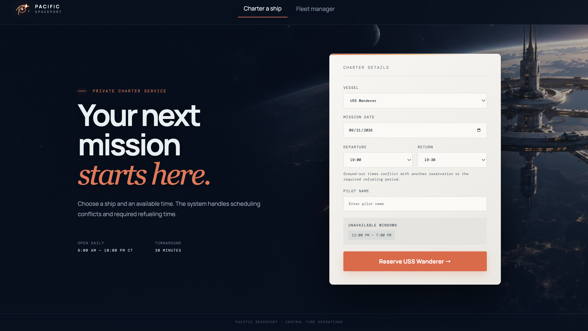
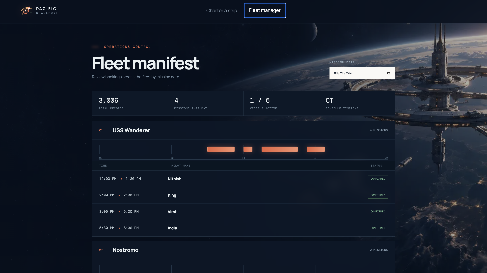

# Pacific Spaceport Charter System

[](https://github.com/nithiskl14-art/spaceport-charter/actions/workflows/backend-tests.yml)

A full-stack scheduling application for the Pacific Spaceport charter fleet.
Dispatchers can view a ship's unavailable periods and reserve a valid departure
window. Fleet managers can review bookings for all five ships on a daily
timeline.

## Technology

- **Frontend:** React, JavaScript, Vite
- **Backend:** Python 3.10–3.14, FastAPI
- **Database:** SQLite
- **Time zone:** `America/Chicago`

## Features and requirements

- Two responsive screens: **Charter a Ship** and **Fleet Manager**
- Five ships loaded from the supplied seed data
- 3,000 generated historical bookings (600 per ship)
- No overlapping bookings for the same ship
- A 30-minute refueling period after every booking
- Bookings restricted to 6:00 AM–10:00 PM Central Time
- Unavailable periods calculated by a dedicated backend endpoint
- Conflicting departure and return choices disabled from backend availability data
- Backend validation remains authoritative even if client checks are bypassed
- Separate error messages for direct overlap and refueling conflicts
- Transactional conflict detection prevents simultaneous double booking
- UTC database storage with Central Time validation and presentation
- Past dates and elapsed departure times rejected
- Refresh-safe `#charter` and `#fleet` navigation
- Automated API, concurrency, seed-import, and frontend time-zone tests
- Date-scoped Fleet requests with a lightweight aggregate summary endpoint
- Deterministic SQLite connection cleanup on every read and write path
- Request IDs, structured access logs, security headers, and database-aware health checks
- Reproducible pinned dependencies and a non-root, health-checked container

The Fleet Manager opens on today when today has bookings. If today is empty, it
opens the latest populated date and clearly identifies that fallback. A user can
select any other date from the date input.

## Prerequisites

For local development, install:

- [Python 3.10–3.14](https://www.python.org/downloads/)
- [Node.js 20 or later](https://nodejs.org/)
- npm (included with Node.js)
- Git

Check your versions:

```bash
python3 --version
node --version
npm --version
```

## Clone the repository

```bash
git clone https://github.com/nithiskl14-art/spaceport-charter.git
cd spaceport-charter
```

If you downloaded the ZIP instead, extract it and open Terminal in the extracted
`spaceport-charter` directory.

## Local setup (recommended)

The backend and frontend run in two separate Terminal windows.

### 1. Prepare the backend and seed data

From the project root:

```bash
python3 -m venv .venv
source .venv/bin/activate
python -m pip install --upgrade pip
python -m pip install -r backend/requirements.txt
python seed.py > seed.json
python backend/seed.py seed.json --reset
```

Expected seed output:

```text
Loaded 5 ships and 3000 bookings
```

On Windows PowerShell, activate the environment with:

```powershell
.venv\Scripts\Activate.ps1
```

The `--reset` flag creates a reproducible local dataset by replacing existing
ships and bookings. The generated `seed.json` and local SQLite database are
ignored by Git.

### 2. Start the backend

Keep the virtual environment active and run this from the project root:

```bash
python -m uvicorn app.main:app --app-dir backend --reload
```

Verify the backend:

- Health check: <http://127.0.0.1:8000/api/health>
- Interactive API documentation: <http://127.0.0.1:8000/docs>
- Ship list: <http://127.0.0.1:8000/api/ships>

Keep this Terminal window running.

### 3. Start the frontend

Open a second Terminal window. From the cloned project root, run:

```bash
cd frontend
npm install
npm run dev
```

Open <http://localhost:5173>. Vite proxies `/api` requests to the backend at
`http://127.0.0.1:8000`.

## Start the project again later

You only need to install dependencies and seed the database once.

Backend Terminal, from the project root:

```bash
source .venv/bin/activate
python -m uvicorn app.main:app --app-dir backend --reload
```

Frontend Terminal, from the project root:

```bash
cd frontend
npm run dev
```

## Docker setup (alternative)

If Docker Desktop is installed and running:

```bash
docker compose up --build
```

Open <http://localhost:8000>. The production container builds the React
frontend, serves it through FastAPI, creates the seed JSON, and imports the seed
data automatically when its persistent database is empty.

To stop it:

```bash
docker compose down
```

To delete the Docker database and force a clean seed import on the next start:

```bash
docker compose down -v
```

## Run the automated checks

Backend tests, from the project root with the virtual environment active:

```bash
python -m pytest backend/tests -q
```

Expected result:

```text
21 passed
```

Frontend tests and production build:

```bash
cd frontend
npm install
npm test
npm run build
```

Expected frontend test result:

```text
9 passed
```

## Suggested manual verification

1. Open **Fleet Manager** and confirm that the total record count is `3,000`
   immediately after a clean seed import.
2. Select a populated date and confirm that seeded bookings appear under the
   correct ships.
3. Open **Charter a Ship**, select the same ship and date, and confirm that the
   backend-provided unavailable windows are displayed.
4. Attempt to book directly inside an existing booking. The request must be
   rejected as an overlap.
5. Attempt to start fewer than 30 minutes after an existing booking. The
   request must be rejected as a refueling conflict.
6. Leave exactly 30 minutes between two bookings. The new booking should be
   accepted.
7. Attempt a booking before 6:00 AM, after 10:00 PM, or in the past through
   `/docs`. The backend must reject it.
8. Create a valid booking and confirm that it immediately appears in Fleet
   Manager. The total becomes `3,001`.

## API

| Method | Endpoint                                      | Purpose                                       |
| ------ | --------------------------------------------- | --------------------------------------------- |
| GET    | `/api/health`                                 | Confirm that the API is running               |
| GET    | `/api/ships`                                  | List vessels                                  |
| GET    | `/api/ships/{id}/unavailable?date=YYYY-MM-DD` | Return backend-calculated unavailable periods |
| POST   | `/api/bookings`                               | Validate and create a booking                 |
| GET    | `/api/bookings/summary`                       | Return total, latest date, and today's count  |
| GET    | `/api/bookings?startDate=...&endDate=...`     | Retrieve all or date-filtered bookings        |

## Scheduling behavior

The API accepts ISO-8601 timestamps with an explicit offset. It converts them to
`America/Chicago` for business-rule validation and stores normalized UTC
timestamps in SQLite.

A booking may start exactly at 6:00 AM or end exactly at 10:00 PM. A gap of
exactly 30 minutes is valid.

Conflict checking and insertion occur in one SQLite `BEGIN IMMEDIATE`
transaction. For an existing interval `[existingStart, existingEnd]`, a new
booking conflicts when:

```text
existingStart < newEnd + 30 minutes
AND
existingEnd > newStart - 30 minutes
```

The unavailable endpoint returns each existing booking plus the 30 minutes
after its end, clips the result to operating hours, and merges adjacent or
overlapping ranges. It does not add 30 minutes before a booking. The booking
creation transaction separately verifies that a booking placed before an
existing booking also leaves the required 30-minute gap.

The Charter screen obtains this unavailable information from the dedicated
endpoint. It does not download the complete booking history and calculate
availability in the browser.

The Fleet Manager first requests the small booking summary, then retrieves only
the selected Central Time date. It does not download the complete booking table
to switch between days.

## Scope decisions

- Time selection uses 30-minute increments; booking duration is otherwise not
  artificially limited.
- A booking must begin and end on the same Central Time calendar date.
- Authentication, cancellation, and editing are outside the requested scope.
- SQLite is appropriate for this focused single-instance submission. For
  horizontally scaled production deployment, PostgreSQL exclusion constraints
  or per-ship advisory locks would provide cross-instance protection.

## Deployment hardening

The submitted container runs as an unprivileged user and includes a database-aware
health check. API responses include request IDs and basic browser security headers,
and request completion is written to structured key-value logs. SQLite lock
failures return a retryable `503` response instead of exposing an internal error.
Every database access path closes its SQLite connection deterministically.

Central wall-clock conversion is iterative so it remains correct when the UTC
guess and requested time fall on opposite sides of a daylight-saving transition.
The frontend suite verifies both spring-forward and fall-back operating dates.

Runtime configuration is supplied through environment variables:

| Variable | Default | Purpose |
|---|---|---|
| `DATABASE_PATH` | `backend/spaceport.db` | SQLite database location |
| `SQLITE_TIMEOUT_SECONDS` | `10` | Maximum wait for a competing writer |
| `CORS_ORIGINS` | `http://localhost:5173` | Comma-separated allowed browser origins |

Dependencies are pinned and CI runs all backend tests on Python 3.10–3.14, plus
the frontend tests and production build on Node.js 22. SQLite runtime files,
generated seed data, dependencies, and build outputs are excluded from Git.

## Project structure

```text
backend/
  app/              FastAPI routes, schemas, database, scheduling service
  tests/            API and scheduling-rule tests
  seed.py           JSON-to-SQLite seed importer
frontend/
  src/              React components, API client, time utilities, styling
seed.py             Assignment-provided seed-data generator
Dockerfile          Production multi-stage build
docker-compose.yml  Local container configuration
```

## Python compatibility

The backend supports Python 3.10, 3.11, 3.12, 3.13, and 3.14. GitHub Actions
runs the backend test suite against every supported version. Docker uses Python
3.12 as one reproducible production runtime, but local development is not
restricted to that version.

## Troubleshooting

### `source: no such file or directory: .venv/bin/activate`

You are either outside the project root or have not created the environment.
Run:

```bash
cd /path/to/spaceport-charter
python3 -m venv .venv
source .venv/bin/activate
```

### `Failed building wheel for pydantic-core`

First confirm that you pulled the current dependency file. It uses a Pydantic
release with wheels for the supported Python versions. Then recreate the
environment and upgrade pip before installing:

```bash
python3 -m venv .venv
source .venv/bin/activate
python -m pip install --upgrade pip
python -m pip install -r backend/requirements.txt
```

### `vite: command not found`

Install the frontend dependencies before starting Vite:

```bash
cd frontend
npm install
npm run dev
```

### The website opens but API data is missing

Confirm that the backend is running on port `8000`, then open
<http://127.0.0.1:8000/api/health>. If the database was never seeded, return to
the project root and run:

```bash
source .venv/bin/activate
python seed.py > seed.json
python backend/seed.py seed.json --reset
```

## Application preview

### Charter a Ship

Dispatchers can select a vessel and date, review backend-calculated unavailable
periods, and reserve a valid departure window.



### Fleet Manager

Fleet managers can inspect daily reservations across all five vessels, including
mission times, pilot names, vessel activity, and total booking records.


